# Face embedding algorithms and open set face recognition 

## Introduction 

The idea of the project was to implement (with transfer learning and some retraining) different face recognition loss functions on a pretrained network architecture, test their performance and show their particulatrites. The pictures used for (re)training the models is a subset of the [Labelled Face in the Wild Dataset](http://vis-www.cs.umass.edu/lfw/).

In a second time,  we use pretrained Facenet embeding (as ours were not enough powerful) as inputs to do an open set face recognition task the dataset used is a small personnal celebrity dataset (**all links to download are below**).

## Summary of the tasks done
1) Face detection and image cropping of the entire dataset
2) Training and benchmark of three algorithm loss for face embedding (SphereFace, CenterLoss and Triplet loss)
3) Test a pretrained face embedding for a open set face recognition problem on a the celebrity dataset.

## How to use this repo
1) **Clone the repo** :
`git clone `
2) Download the data with this [link](https://drive.google.com/drive/folders/13ySIhIpwhYiprQblIZNIuUms9-mD3LoH?usp=sharing)
    -Copy the data folder in the root of this repo
3) Run the notebook you want (as the two are independant)

## Useful definitions of face recognitions problems
**Face verification :** 
A face verification problem consist in checking if two input images are the same person or not.  

**Face recognition :**
A face recognition problem consist in checking if the input image corresponds to one of the person in database. It can be done, for example, running multiple face verifications between the input image and the entire dataset. This method can be assimilated to _one shot learning_ .  

**Open set problem :** 
Open-set classification is a problem of handling unknown classes that are not contained in the training dataset, whereas traditional classifiers assume that only known classes appear in the test environment.

**One shot learning problem :**
*One-shot learning is an object categorization problem, found mostly in computer vision. Whereas most machine learning based object categorization algorithms require training on hundreds or thousands of samples/images and very large datasets, one-shot learning aims to learn information about object categories from one, or only a few, training samples/images.* ([Wikipedia](https://en.wikipedia.org/wiki/One-shot_learning))

## Main approach for face recognition problems :
Most of the face recognition use cases are open set problems, we cannot train a neural network to solve the problem. Also it can be assimilated as one shot learning problems in the sense it often uses only few training examples to classify the new ones. 

The main appraoch to solve those challenges, is to first learn *face embedings* one a closed set of identities. Then we can use those vectorial/hidden representations to compute similiraty between faces as *a face verification* problem : if the similarity between to faces is strong we can infer than the two faces are the same. To finish this approach can be extended to a  *open set classification problem* by taking the greater similarity among a different identities.

## Part 1 :  loss comparison for face embedding

In this first part, we tried to fit three different losses found in the litterature to learn face embeddings on a subset of LFW dataset. You can find our work in the **Part 1** notebook.

### Pipeline for data transformation

Before to present theoritically the losses used, here it is  the pipeline we did to do the training part : 
1) Face cropping using an [haar cascade classifier](https://towardsdatascience.com/computer-vision-detecting-objects-using-haar-cascade-classifier-4585472829a9) 
2) Image resizing to be fed into the network
3) Image normalizing. To do so we substracted every pixels by 128 and divided them 127.5 as done in a lot of litterature protocols (eg . [this paper](https://arxiv.org/pdf/1704.08063.pdf) )

To enhance this pipeline we should have done face alignement and image augmentation (rotations, deformation, adding noise ...).

### Loss presentation
We implemented, above a pre trainded Mobile net architecture those three losses and trained the models.

#### Triplet loss
Let A the hidden representation of a face, P the hidden representation of another face with the same identity and N the hidden representation of a face with another identity.
The triplet loss aim to minimize : 
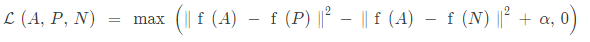

Where alpha is a margin parameter (the highest it is the more loss is "permissive"). The idea of this loss function is to pass three examples through the neural network and (an Anchor a Postive and a Negative) instead of one to try to separate as much as possible the hidden representations of the different identities.

The problem with this loss is the triplet generation : it is costly and difficult to choose triplets of image adequatly.

#### Center loss
Based on this [paper](https://ydwen.github.io/papers/WenECCV16.pdf) and helped from this [repo](https://github.com/handongfeng/MNIST-center-loss), we implemented the center face loss to learn embeddings on our dataset.

The center loss is defiend as the following :

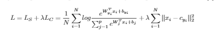

Where
 - c_{y_i} denotes the yith class center of deep features.
 - lambda is the tradeoff parameter between the softmax loss and the variance of the hidden representations

#### Sphere Face loss
Based on this [paper](https://arxiv.org/pdf/1801.07698.pdf) and helped from this [repo](https://github.com/4uiiurz1/keras-arcface), we implemented the sphere face loss to learn embeddings on our dataset.

The sphere face loss is slightly [A-softmax loss function](https://towardsdatascience.com/additive-margin-softmax-loss-am-softmax-912e11ce1c6b) described as the following : 

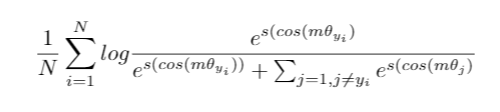

Where
 - \theta_{j} represents the angle between W_j (weights of the previous layer) and the feature x_i
 - m is a multiplicative margin  penality
 - s is scale penality 

We did not understand all the geometric specifities of this loss, however it seems to push the network to separate as much as possible the embedding of different classes.

### Results
We trained for 25 epochs two versions of each network/loss (changing the losses hyperparameters). Our embeding size is of 256 neurons. We tried to vizualize our representations with a TSNE algorithm. You can find all the losses and embedding graphs below. You can find more interpretations and plot in the **Part1 Notebook** but, to sum up, none of our networks did not achieved good results (in term of accuracy or embeddings).

#### "Triplet networks"

"Triplet networks" loss :

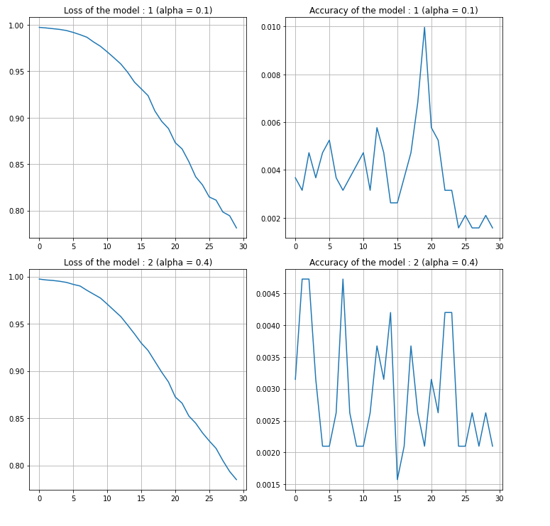

"Triplet networks" embedding:

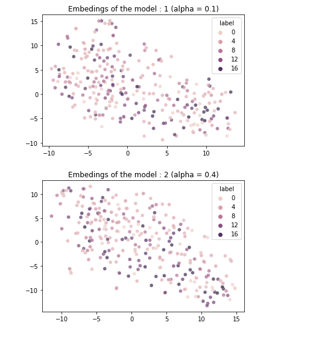

#### "Center networks" 

"Center networks" loss : 

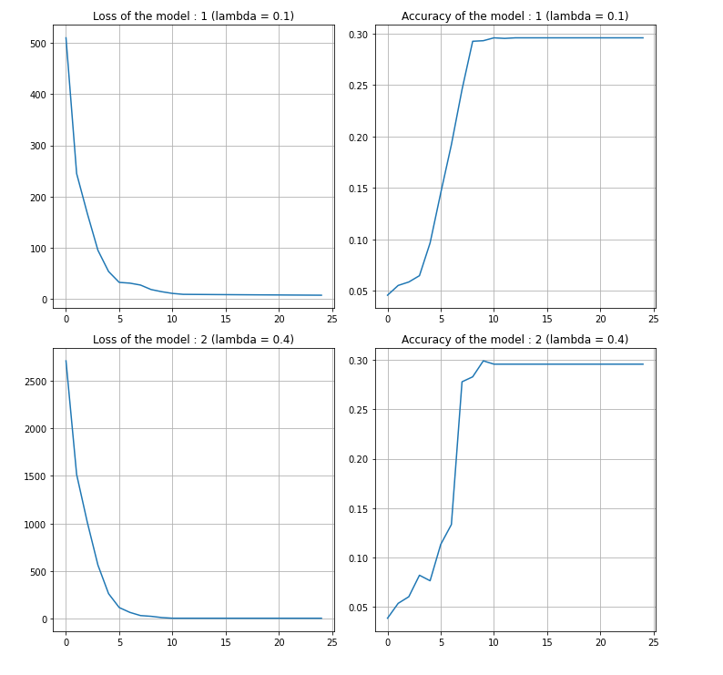

"Center networks" embedding:

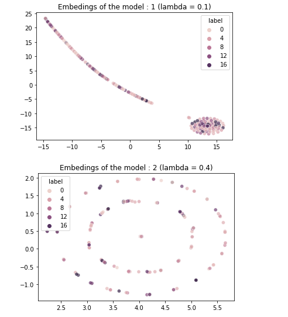

#### "Sphere networks" 

"Sphere networks" loss : 

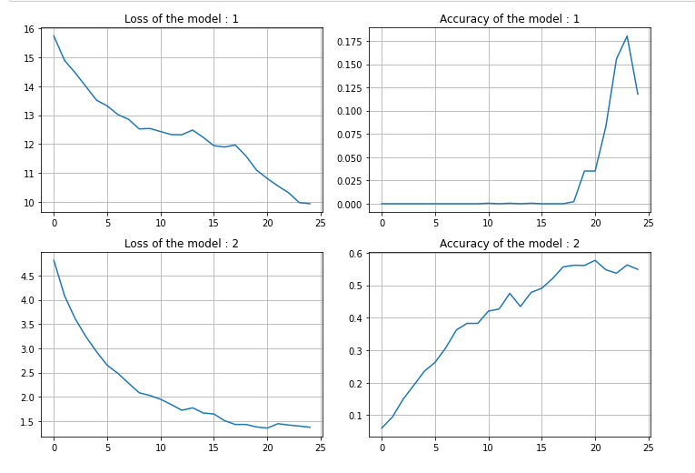

"Sphere networks" embedding:

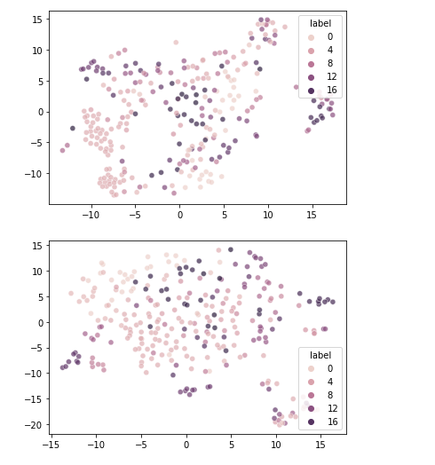

### Possible explanations of the "poor" results
Many things could have been enhanced to have best results.
#### Data
- We only use 10% of whole LFW dataset due to computationnal cost of the algorithm. This dataset is already considered as small for a face regonition task.
- Haar cascade is not the best face detector we could have taken. Some face cropping is failing in our training set. We should have used better models like MTCNN model.
- We did not do face alignement
- The dataset is really imbalanced, pushing the network to overspecialize  

#### Hyperparameters
- Due to the computationnal cost, we did not have tested most combinations of hyperparameters.

#### Implementation
- We may have failed at  building the embdedding models properly.

## Part 2 : Open set recognition with a pretrained facenet model

For this part, we used a personnalized celebrity dataset. It is composed of pictures of 5 celibrities and a bunch a of pictures of unidentified people.

The idea is to take a little set of pictures of each celebrities (1,2,3 or 4) as an identification set (which can be assimilated to training set) and try to see if we can classify the identity of the other pictures based on this small sample.

To do so we use we embed each face using a pre trained Facenet model and try to  measure cosine similarity between the embedings of the test set and the one of the identification set. If the similarity is below a certain threshold we can consider that the picture have the same identity. If no pictures have came below the threshold we consider that the person is unknown.

### Pipeline for data transformation

1) Face cropping using an MTCNN algorithm (as the haar cascade did not give very good results on the part one) 
2) Image resizing to be fed into the pre trained network
3) Image normalizing.

### Results : 

Playing with the threshold hyper parameter and the number of pictures by identities in the identification set we achieved really good results in term of accuracy and confusion matrix.

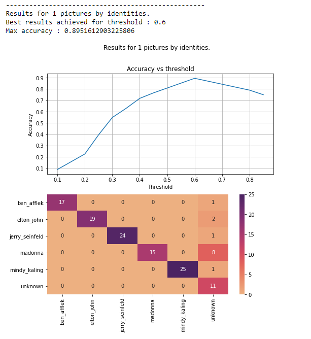
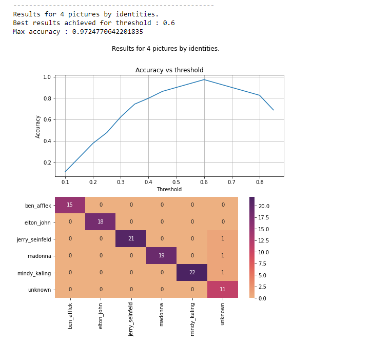

We did some "negative mining" on the missclassified  images, the erros was mainly due to bad face cropping or low resolution.

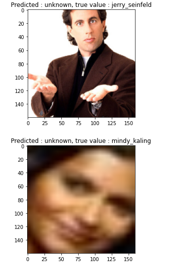

You can find all the protocol and plot in the **Part2 Notebook**.

